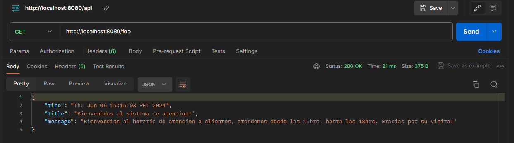
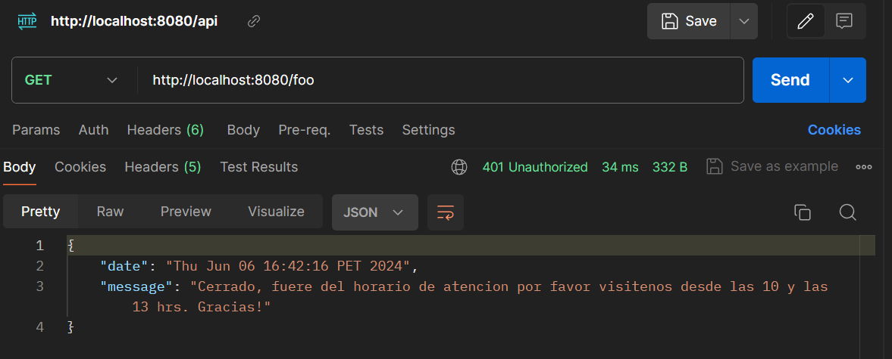

# Api-Horario de atencion-Spring
## Descripción del proyecto

Implementar un sistema de atencion al cliente.
Registro horario de atencion al cliente desde las 15hr a 18hr.
<!-- Registro horario de entrada y salida de empleados de un restaurante. -->

## Implementacion

Agregamos un configuracion en el package principal para registar el interceptor `MvcConfig`.

```java
@Configuration
public class MvcConfig implements WebMvcConfigurer {

    @Autowired
    @Qualifier("calendarInterceptor")
    private HandlerInterceptor calendar;

    @Override
    public void addInterceptors(InterceptorRegistry registry) {
        registry.addInterceptor(calendar).addPathPatterns("/foo");
    }
}
```

Usamos el interceptor `CalendarInterceptor` implementado con la interface `HandlerInterceptor` para 
agregar la funcionalidad al controlador `AppController` de mostrar un mensaje en formato `JSON`.

```java
@RestController
public class AppController {
    
    @GetMapping("/foo")
    public ResponseEntity<?> foo(HttpServletRequest request) {

        // Calendar calendar = Calendar.getInstance();
        // int hour = calendar.get(Calendar.HOUR_OF_DAY);

        Map<String, Object> data = new HashMap<>();
        data.put("title", "Bienvenidos al sistema de atencion!");
        // data.put("time", hour);
        data.put("time", new Date().toString());
        data.put("message", request.getAttribute("message"));
        return ResponseEntity.ok(data);
    }
}
```
```java
@Component
public class CalendarInterceptor implements HandlerInterceptor {
    //agregamos valores desde application.properties ubicadoe en la carpeta resources
    @Value("${config.calendar.open}")
    private Integer open;

    @Value("${config.calendar.close}")
    private Integer close;

    @Override
    public boolean preHandle(HttpServletRequest request, HttpServletResponse response, Object handler)
            throws Exception {
        Calendar calendar = Calendar.getInstance();
        int hour = calendar.get(Calendar.HOUR_OF_DAY);
        System.out.println(hour);

        if (hour >= open && hour < close) {
            StringBuilder message = new StringBuilder("Bienvendios al horario de atencion a clientes");
            message.append(", atendemos desde las ");
            message.append(open);
            message.append("hrs.");
            message.append(" hasta las ");
            message.append(close);
            message.append("hrs.");
            message.append(" Gracias por su visita!");
            request.setAttribute("message", message.toString());
            return true;
        }

        ObjectMapper mapper = new ObjectMapper();
        Map<String, String> data = new HashMap<>();
        StringBuilder message = new StringBuilder("Cerrado, fuere del horario de atencion ");
        message.append("por favor visitenos desde las ");
        message.append(open);
        message.append(" y las ");
        message.append(close);
        message.append(" hrs. Gracias!");
        data.put("message", message.toString());
        data.put("date", new Date().toString());
        response.setContentType("application/json");
        response.setStatus(401);
        response.getWriter().write(mapper.writeValueAsString(data));

        return false;
    }

    @Override
    public void postHandle(HttpServletRequest request, HttpServletResponse response, Object handler,
            @Nullable ModelAndView modelAndView) throws Exception {

    }
}
```

## Uso de Postman

**GET**
```sh
http://localhost:8080/foo
```



* Cambiando de el horario en el `application.properties` para que este fuera del rango establecido.



